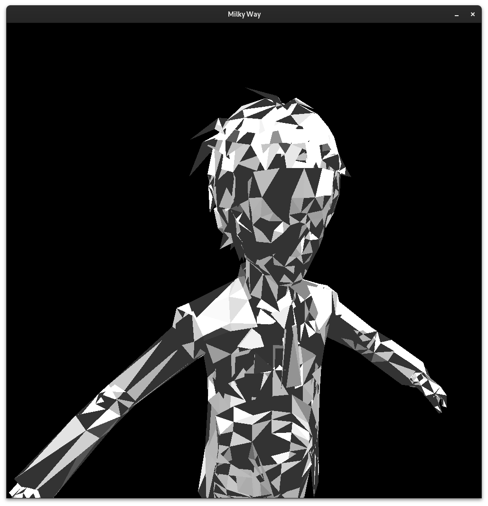

# Milky Way: A simple 3D renderer and physics engine in C++/SFML

This simple program loads a model from an .obj file and renders it bouncing whilst losing energy.
The software was created by Dominik Śliwiński as an exercise in linear algebra and physics and published under GNU GPLv2.
The program is made in C++ with the use of the Simple Fast Multimedia Library.

Command syntax: `milkyWay [wavefront obj file]`

